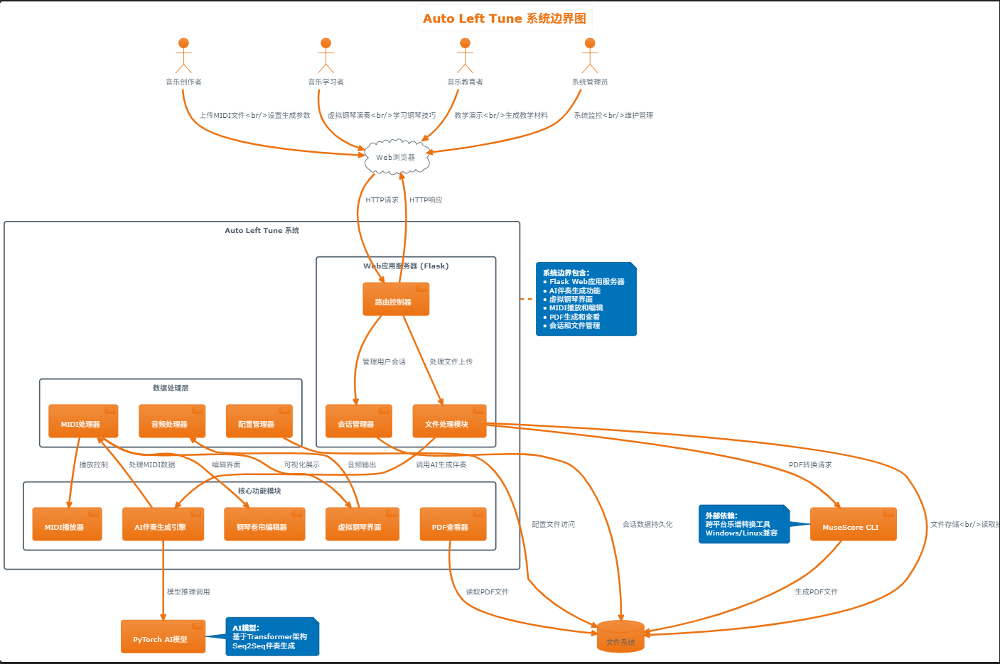
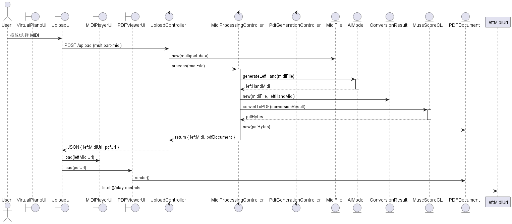

## 引言
### 编写目标
本软件需求文档旨在明确描述 AutoLeftPiano 系统的功能性与非功能性需求，作为系统设计、开发、测试、验收和后期维护的重要依据。AutoLeftPiano 是一个基于 Flask 的 Web 应用，能够接受用户上传的只含右手旋律的 MIDI 文件，并利用我们训练 AI 模型自动生成包含左手伴奏的完整钢琴曲。系统还支持 MIDI 播放、PDF 预览、钢琴交互演奏等辅助功能。

本文件将加深与项目相关各参与人对软件目标、功能模块、界面行为和技术架构的理解，确保开发过程有据可依、验收标准清晰明确，从而提升项目效率和交付质量。
### 读者对象
本文档适用于所以与项目相关的参与人，具体包括：
- **项目发起人与管理人员：** 了解项目目标与范围
- **产品设计人员与需求分析师：** 基于本文件明确产品功能设计
- **后端开发工程师：** 依据接口与功能描述实现逻辑处理与模型集成；
- **前端开发工程师：** 根据交互需求实现用户界面与播放控制功能；
- **AI 模型工程师：** 参考功能描述与模型输出要求，优化伴奏生成算法；
- **测试工程师：** 制定测试计划，验证系统功能和性能是否符合需求；
- **运维与支持人员：** 了解系统部署需求和文件处理流程；
- **最终用户文档编写人员：** 基于此文档撰写使用手册和帮助文档。
### 文档概述
本需求文档主要包含以下内容：
- **引言部分：** 说明本项目的目标、读者范围、文档结构和相关术语；
- **系统概述：** 简要介绍 AutoLeftPiano 软件的定位、用户特征、约束条件以及外部依赖；
- **功能性需求：** 详细列出系统支持的功能，包括上传与生成、MIDI 播放、PDF 查看、虚拟钢琴互动等模块；
- **非功能性需求：** 定义系统的性能要求、兼容性、安全性、可维护性等；
- **界面需求：** 描述用户与系统交互的界面设计与可视化组件；
- **接口定义：** 列出系统的关键 API 和与外部程序（如 MuseScore CLI）的交互接口；
- **进度与交付要求：** 确定项目实施过程的时间安排与交付方式；
- **验收标准：** 明确软件达到可交付状态所需满足的指标和条件。
### 术语定义
|术语    |   定义    |
|--------|-----------|
|AutoLeftPiano|本项目的软件名称，用于自动生成钢琴左手伴奏并集成播放与展示功能的 Web 系统|
|MIDI|Musical Instrument Digital Interface，一种用于存储和传输音乐演奏数据的文件格式|
|AI模型|用于自动生成左手伴奏部分的机器学习模型，基于已训练的数据进行推理|
|MuseScore CLI|MuseScore 软件提供的命令行接口，用于将 MIDI 转换为可视化钢琴谱（PDF）等处理|
|Flask|Python 语言的轻量级 Web 应用框架，用于后端服务搭建|
|Blueprint|Flask 的模块化开发机制，用于组织项目中的路由逻辑和功能模块|
|Tone.js|JavaScript 库，用于处理音频播放、合成和调度，实现虚拟钢琴的交互演奏|
|PDF.js|用于在 Web 页面中渲染和浏览 PDF 文件的 JavaScript 库|
|虚拟钢琴界面|Web 页面中实现的可点击式钢琴键盘，用于播放音符音效|
|转换后的MIDI文件|指通过 AI 模型生成包含左手伴奏的完整钢琴 MIDI 文件|
|交互式钢琴演奏|用户通过鼠标点击网页上的琴键，实现钢琴音符播放的功能|

## 软件系统概述
### 软件产品概述
AutoLeftPiano 是一款基于 Flask 的 Web 应用，面向音乐创作与学习场景，能够自动为只含右手旋律的 MIDI 文件生成左手伴奏，并输出完整的钢琴谱与 MIDI 文件。核心功能模块包括：
- **MIDI 文件处理**：用户上传右手旋律 MIDI，后台调用预训练 AI 模型生成完整双手 MIDI，并通过 MuseScore CLI 渲染成 PDF。
- **虚拟钢琴演奏**：在网页顶部渲染可点击的虚拟钢琴键盘，借助 Tone.js 播放采样音色，实现实时演奏体验。
- **PDF 查看与管理**：集成 PDF.js，支持原始与转换后谱面的查看、下载、展开/折叠。
- **MIDI 播放器**：提供播放/暂停/停止、进度条、音量与时间显示，支持对比原始与转换后文件的听感差异。

系统采用前后端分离思路，前端用 HTML5/CSS3 + ES6 实现交互与渲染，后端基于 Flask + Blueprint 模块化组织路由与业务逻辑，所有文件统一存储于 `app/files/` 目录，模板渲染与静态资源服务由 Flask 负责。
### 用户特征
- **音乐爱好者 & 学习者**  
  - 对钢琴演奏与伴奏编写感兴趣，但可能缺乏深厚的和声理论基础  
  - 期望通过自动化工具快速生成伴奏以辅助练习和创作
- **业余/专业作曲者**  
  - 需要尝试不同风格的左手伴奏、快速生成草稿  
  - 希望在线保存并对比不同版本的 MIDI 与谱面
- **音乐教育者**  
  - 在教学中演示自动伴奏生成效果  
  - 为学生提供多样化的练习示例
- **技术运维 & 管理人员**  
  - 关注系统部署环境与依赖  
  - 负责服务器性能监控与安全维护
### 设计和实现约束
1. **技术栈限定**  
   - 后端必须使用 Python 3.8+ 与 Flask 框架，路由分层采用 Blueprint 
   - ai模型的训练使用pytorch框架 
   - 前端使用标准的 HTML5/CSS3、原生 ES6+ JavaScript，依赖 Tone.js 与 PDF.js  
2. **性能与并发**  
   - 单个 MIDI 文件伴奏生成时长应控制在 60 秒以内，支持并发处理不低于 5 个用户请求  
   - 文件上传大小限制在 5 MB 以内，转换后文件最大不超过 10 MB  
3. **跨平台兼容**  
   - 部署环境需同时支持 Linux 与 Windows Server
   - 浏览器兼容主流现代浏览器（Chrome、Firefox、Edge、Safari）  
4. **安全与权限**  
   - 上传与下载均通过 HTTPS 完成，文件临时存储目录需设定访问权限  
   - 后端接口应做输入校验，防止上传恶意文件与命令注入  
5. **可维护性**  
   - 代码需符合 PEP8 规范，模块化结构清晰，单元测试覆盖率不低于 80%  
   - 配置与模型权重存放在 `app/config/` 与 `app/models/`，可通过环境变量或配置文件灵活切换
### 假设和依赖
- **用户假设**  
  - 用户上传的 MIDI 文件仅包含右手旋律通道，且格式合法（标准 MIDI 0/1 格式）  
  - 用户通过在线钢琴手动输入右手旋律
  - 用户具有稳定的网络连接，可完成文件上传、下载与在线预览  
- **系统依赖**  
  - **Python 环境**：Python 3.8+，Flask、numpy、mido、torch 等库  
  - **MuseScore CLI**：已在服务器上正确安装并配置环境变量  
  - **前端依赖**：Tone.js、PDF.js 通过 CDN 或本地静态资源引入  
  - **AI 模型权重**：存放在hugging face上，第一次使用脚本时自动下载，定期更新与备份  
  - **服务器环境**：Linux/Windows，HTTPS 证书，反向代理（如 Nginx）可选  
## 功能性需求描述
### 软件功能概述
AutoLeftPiano 聚焦于将仅含右手旋律的 MIDI 文件一键转换为完整双手钢琴谱并提供在线交互体验，其核心功能包括：

- **MIDI 文件上传**  
  通过拖放或文件选择，上传只含右手旋律的 MIDI 文件，并实时显示上传进度。

- **AI 左手伴奏生成**  
  后端调用预训练模型，对上传的 MIDI 进行推理，生成包含左手伴奏的完整双手 MIDI 文件。

- **钢琴谱 PDF 转换**  
  利用 MuseScore CLI 将生成的双手 MIDI 自动渲染为标准钢琴谱 PDF，可在线预览和下载。

- **虚拟钢琴互动**  
  基于 Tone.js 渲染可点击的虚拟钢琴键盘，支持鼠标和键盘两种演奏方式，并可示范自动演奏。

- **MIDI 播放对比**  
  内置播放器支持原始与生成后 MIDI 的切换播放、进度控制、音量调节和时间对比。

- **PDF 查看管理**  
  集成 PDF.js 提供缩放、翻页、折叠面板等查看功能，并可一键下载当前谱面。

- **通知与文件管理**  
  实时提示上传、生成、转换状态；文件自动清理与历史记录管理，用户可查看、下载或删除近期期望文件。
### 软件需求的用例模型
#### 参与者
**主参与者**
- **用户** ：传 MIDI 文件、查看生成的钢琴谱、播放和比较原始/转换后的 MIDI。
**次要参与者**
- **系统管理员** ：管理服务器、日志、配置和模型更新
- **AI模型服务** ：接收右手 MIDI，返回带左手伴奏的 MIDI 和乐谱。
- **MuseScore CLI** :将 AI 模型生成的 MIDI 文件转换为 PDF 乐谱。
#### 用例
|用例编号|用例名称|主要参与者|简要说明|
|-------|--------|---------|-------|
|UC1|上传midi文件|用户|用户通过拖放或文件选择上传右手 MIDI|
|UC2|处理 MIDI 文件|系统|系统调用 AI 服务生成带左手的完整 MIDI|
|UC3|查看生成的钢琴谱（PDF）|用户|使用 PDF.js 在页面上查看原始/转换后乐谱|
|UC4|下载生成的文件|用户|下载原始 MIDI、转换后 MIDI 和 PDF|
|UC5|播放 MIDI 文件|用户|在页面中用 Tone.js 播放并比较 MIDI|
|UC6|管理与配置|管理员|管理后台配置、日志与模型版本|
#### 系统边界


系统边界图展示了AutoLeftPiano系统的主要参与者和系统功能边界。用户可以通过Web界面上传MIDI文件、查看生成的钢琴谱、播放MIDI文件等。系统管理员负责管理和维护系统。AI模型服务负责生成左手伴奏，MuseScore CLI负责将MIDI转换为PDF乐谱。

#### 用例之间的关系

| 主用例             | 相关用例             | 关系类型         | 描述                                                                 |
|--------------------|----------------------|------------------|----------------------------------------------------------------------|
| UC1 上传 MIDI      | UC2 处理 MIDI        | include      | 上传文件成功后自动触发处理流程，因此处理是上传的一部分流程。                |
| UC2 处理 MIDI      | UC5 播放 MIDI        | include      | 处理完成后生成的 MIDI 可直接用于播放，因此播放是处理的后续操作。            |
| UC3 查看 PDF       | UC4 下载文件         | extend       | 用户查看乐谱时可选择是否下载 PDF，下载是可选扩展行为。                      |
| UC2 处理 MIDI      | AI 模型服务          | include      | 系统总是调用 AI 模型服务生成左手伴奏，属于处理 MIDI 的内部逻辑之一。        |
| UC3 查看 PDF       | MuseScore CLI        | include      | 系统调用 MuseScore CLI 将 MIDI 转换为 PDF，是查看 PDF 的基础支撑流程。       |
#### 用例描述
## UC1: 上传 MIDI 文件

**参与者**：用户  
**前置条件**：用户已打开 Web 应用页面。  
**后置条件**：MIDI 文件已成功上传至服务器，并显示上传进度及成功提示。

### 主成功场景：
1. 用户打开“上传”面板。  
2. 用户将右手 MIDI 文件拖入区域或点击按钮选择文件。  
3. 点击“上传并处理”按钮 
4. 上传完成后，系统提示“上传成功”。  
5. 随后显示处理完成的结果面板

### 可选流程 / 异常流程：
- 3a. 文件格式非法 → 系统提示“仅支持 MIDI 文件”。  
- 3b. 上传失败 → 系统提示“文件名不能包含中文”。

---

## UC2: 处理 MIDI 文件

**参与者**：系统  
**前置条件**：UC1 完成，服务器收到 MIDI 文件。  
**后置条件**：生成带左手伴奏的完整 MIDI 和 PDF 乐谱文件。

### 主成功场景：
1. 系统调用 AI 模型服务，传入右手 MIDI。  
2. AI 服务处理并返回完整 MIDI 文件。  
3. 系统调用 MuseScore CLI，将完整 MIDI 转为 PDF。  
4. 存储生成的 MIDI 与 PDF，更新处理状态为“完成”。

### 可选流程 / 异常流程：
- 2a. 模型处理超时 → 重试或提示“处理超时，请稍后再试”。  
- 3a. MuseScore 转换出错 → 提示“乐谱生成失败”。

---

## UC3: 查看生成的钢琴谱（PDF）

**参与者**：用户  
**前置条件**：UC2 完成并生成 PDF 文件。  
**后置条件**：在页面中嵌入 PDF.js 查看器显示乐谱。

### 主成功场景：
1. 用户点击“查看乐谱”按钮。  
2. 系统加载 PDF.js 并渲染原始/转换后乐谱。  
3. 用户可以使用展开/折叠及下载功能。

### 可选流程 / 异常流程：
- 2a. PDF 加载失败 → 显示“查看失败，请刷新或重试”。
---

## UC4: 下载生成的文件

**参与者**：用户  
**前置条件**：对应文件已生成并存储。  
**后置条件**：浏览器触发下载。

### 主成功场景：
1. 用户在文件列表或查看页面点击下载按钮。  
2. 系统返回文件流，浏览器开始下载。

### 可选流程 / 异常流程：
- 2a. 文件不存在 → 提示“文件未找到”。

---

## UC5: 播放 MIDI 文件

**参与者**：用户  
**前置条件**：原始或转换后的 MIDI 文件可用。  
**后置条件**：在 Tone.js 虚拟钢琴或播放器中听到音频输出。

### 主成功场景：
1. 用户点击“播放”按钮。  
2. 系统加载 Tone.js，渲染虚拟钢琴和进度条。  
3. 音频播放，用户可操作暂停/停止/调节音量。

### 可选流程 / 异常流程：
- 2a. 音频加载失败 → 提示“播放失败，请检查浏览器音频设置”。

---

## UC6: 管理与配置

**参与者**：系统管理员  
**前置条件**：管理员已登录后台。  
**后置条件**：完成对模型版本、日志、文件存储策略等配置。

### 主成功场景：
1. 管理员在后台仪表盘查看系统状态。  
2. 管理员更新模型服务地址或日志级别。  
3. 系统保存配置并反馈“配置已更新”。

### 可选流程 / 异常流程：
- 2a. 权限不足 → 提示“无权操作”。

### 软件需求的分析模型
#### 顺序图

该软件的顺序图如图所示，从左到右分别涉及到该软件的边界类、控制类、实体类，也展示了对象之间消息传递
#### 类的划分
|类的划分|对象|职责|
|-------|----|----|
|边界类(Boundary)|VirtualPianoUI、UploadUI、MIDIPlayerUI、PDFViewerUI|与用户交互、收集输入、渲染页面组件、调用 Control 层接口|
|控制类(Control)|UploadController、MidiProcessingController、PdfGenerationController|协调各实体，执行业务逻辑：接收请求、调用 AI 模型生成、调用 MuseScore CLI、打包结果|
|实体类(Entity)|MidiFile、AIModel、ConversionResult、MuseScoreCLI、PDFDocument|封装核心数据与算法：MIDI 数据、AI 模型推理、转换结果、PDF数据|

#### 对象之间的消息传递
| 发送者                         | 接收者                         | 消息内容                                      | 同步 / 异步 |
|------------------------------|------------------------------|---------------------------------------------|-----------|
| User                         | UploadUI                     | 拖放/选择 MIDI 文件                              | 同步        |
| UploadUI                     | UploadController             | POST /upload (multipart-midi)               | 同步        |
| UploadController             | MidiFile                     | new(multipart-data)                         | 同步        |
| UploadController             | MidiProcessingController     | process(midiFile)                           | 同步        |
| MidiProcessingController     | AIModel                      | generateLeftHand(midiFile)                  | 异步        |
| AIModel                      | MidiProcessingController     | leftHandMidi                                | 异步        |
| MidiProcessingController     | ConversionResult             | new(midiFile, leftHandMidi)                 | 同步        |
| MidiProcessingController     | MuseScoreCLI                 | convertToPDF(conversionResult)              | 异步        |
| MuseScoreCLI                 | MidiProcessingController     | pdfBytes                                    | 异步        |
| MidiProcessingController     | UploadController             | return { leftMidi, pdfDocument }            | 同步        |
| UploadController             | UploadUI                     | JSON { leftMidiUrl, pdfUrl }                | 同步        |
| UploadUI                     | MIDIPlayerUI                 | load(leftMidiUrl)                           | 同步        |
| UploadUI                     | PDFViewerUI                  | load(pdfUrl)                                | 同步        |
| PDFViewerUI                  | PDFDocument                  | render()                                    | 同步        |
| MIDIPlayerUI                 | leftMidiUrl                  | fetch()/play controls                       | 同步        |
| VirtualPianoUI               | Tone.js                      | playSample(note)                            | 同步        |

## 非功能性需求描述
1. **性能**  
   - 系统应在标准服务器环境下，支持至少 5 个并发伴奏生成请求，单次生成响应时间不超过 30 秒。  
   - Web 前端页面加载（首屏渲染）时间应 ≤ 1 秒；操作响应（上传、下载、播放切换）延迟 ≤ 200 ms。

2. **可靠性与可用性**   
   - 对关键模块（AI 模型、MuseScore CLI、文件存储）实现健康监测与自动重试。  
   - 异常（如模型加载失败、硬盘 IO 错误）需自动告警并记录详细日志。

3. **安全性**    
   - 文件上传接口需校验 MIME 类型和文件头，防止恶意内容；单文件大小限制 ≤ 5 MB。  
   - 实现基于角色的访问控制（RBAC），管理员与普通用户权限隔离。  
   - 定期进行安全扫描与漏洞修复。

4. **可维护性**  
   - 代码规范，函数/类注释齐全。  
   - 模块化设计，后端按 Blueprint 划分业务域；前端组件化组织虚拟钢琴、播放器与查看器。  
   - 单元测试覆盖率 ≥ 80%，集成测试涵盖文件上传、生成、播放、查看等核心流程。  
   - 文档齐全，包括软件需求文档，软件设计文档，用户手册

5. **可扩展性**  
   - AI 模型层支持替换与升级，无需改动前端或其他后端业务逻辑。  
   - 文件存储设计可替换为对象存储（如 AWS S3）或分布式文件系统。  
   - 支持多实例部署，通过负载均衡进行水平扩展。

6. **兼容性**  
   - 浏览器：Chrome、Edge等  
   - 操作系统：后端支持 Linux（Ubuntu 20.04+）和 Windows Server 2019+；前端兼容主流桌面操作系统。  
## 界面需求
1. **整体布局**  
   - 顶部导航栏包含系统名称、用户信息和帮助入口；左侧或下方为操作面板，右侧为主显示区域（虚拟钢琴或 PDF 查看器）。  
   - 响应式设计：支持常见分辨率（≥ 1024×768），最小化后亦能正常操作。

2. **虚拟钢琴界面**  
   - 占页面上半区域；键盘图形与真实钢琴键尺寸比例一致；点击或键盘输入高亮对应琴键并播放音符。  
   - 播放器播放时，实时高亮琴键；播放过程中可暂停、恢复。

3. **文件上传与生成面板**  
   - 拖放区域明显标识，支持点击选择文件；上传后显示进度条、文件名、大小和取消按钮。  
   - 生成中展示进度提示与进度动画；生成完成后显示“查看 MIDI”与“查看 PDF”按钮。

4. **MIDI 播放器控件**  
   - 播放/暂停/停止按钮居中，进度条下方显示当前时间/总时长；音量控制在右侧；左/右切换按钮可对比原始与生成文件。

5. **PDF 查看器**  
   - PDF渲染区支持打开、折叠功能，并且可以滑动上下查看pdf
## 接口定义
| 接口名称               | 方法  | 路径                           | 请求参数                               | 返回结果                              | 说明                               |
|------------------------|-------|--------------------------------|----------------------------------------|---------------------------------------|------------------------------------|
| 首页                   | GET   | /                              | 无                                     | HTML页面                              | 返回首页模板                       |
| MIDI编辑器页面         | GET   | /MidiEditor                    | 无                                     | HTML页面                              | 返回MIDI编辑器页面模板             |
| 上传MIDI文件           | POST  | /upload                        | file: MIDI文件(.mid格式)               | JSON: {success, session_id, message, converted_midi_name, converted_pdf_name} 或 {error} | 上传并处理MIDI文件，自动生成左手版本和PDF |
| 转换PDF                | GET   | /convert-to-pdf/\<session_id\> | session_id: 会话ID（路径参数）         | JSON: {success, message} 或 {success, error} | 将处理后的MIDI文件转换为PDF格式    |
| 下载文件               | GET   | /download/\<file_type\>/\<session_id\> | file_type: 文件类型(midi/pdf), session_id: 会话ID | 文件流或JSON错误信息                  | 下载转换后的MIDI文件或PDF文件      |
| 获取会话信息           | GET   | /session/\<session_id\>        | session_id: 会话ID（路径参数）         | JSON: {exists, filename, converted_midi_name, converted_pdf_name} | 获取指定会话的文件信息             |
| 预览PDF                | GET   | /view-pdf/\<session_id\>       | session_id: 会话ID（路径参数）         | PDF文件流或JSON错误信息               | 在线预览处理后的PDF文件            |
| 导出原始MIDI的PDF      | GET   | /export-original-pdf/\<session_id\> | session_id: 会话ID（路径参数）         | JSON: {success, message} 或 {success, error} | 将原始MIDI文件导出为PDF格式        |
| 预览原始PDF            | GET   | /view-original-pdf/\<session_id\> | session_id: 会话ID（路径参数）         | PDF文件流或JSON错误信息               | 在线预览原始MIDI的PDF文件          |
| 下载原始PDF            | GET   | /download-original-pdf/\<session_id\> | session_id: 会话ID（路径参数）         | PDF文件流或JSON错误信息               | 下载原始MIDI文件的PDF版本          |
| 下载原始MIDI           | GET   | /download/original-midi/\<session_id\> | session_id: 会话ID（路径参数）         | MIDI文件流或JSON错误信息              | 下载原始上传的MIDI文件             |

### 接口详细说明

#### 1. 上传MIDI文件 (/upload)
- **请求格式**: multipart/form-data
- **文件要求**: 
  - 必须是.mid格式
  - 文件名不能包含中文字符
- **成功返回示例**:
```json
{
  "success": true,
  "session_id": "uuid格式的会话ID",
  "message": "文件已成功处理，PDF已生成",
  "converted_midi_name": "converted_原文件名.mid",
  "converted_pdf_name": "原文件名.pdf"
}
```
- **错误返回示例**:
```json
{
  "error": "错误信息"
}
```

#### 2. 会话管理
- 所有会话相关接口都需要提供有效的session_id
- session_id在上传文件时生成，用于标识用户的处理会话
- 会话数据包含原始文件、处理后文件和PDF文件的路径信息

#### 3. 文件类型说明
- **midi**: 处理后的MIDI文件（左手版本）
- **pdf**: 处理后MIDI文件对应的PDF乐谱
- **original-midi**: 原始上传的MIDI文件
- **original-pdf**: 原始MIDI文件对应的PDF乐谱

#### 4. 错误处理
- 所有接口都会返回适当的HTTP状态码
- 404: 会话不存在或文件不存在
- 400: 请求参数错误
- 500: 服务器内部错误（如文件处理失败）
## 交付要求
- **交付文档**：  
  - 需求文档（本文件），设计文档，用户手册。  
- **交付代码**：  
  - 后端源代码，前端资源代码，数据预处理、AI训练脚本代码  
- **交付环境**：  
  - 可支持本地部署的Web & AI app
- **交付时间**：  
  - 2025年6月
## 何种形式来交付
- **文档格式**：Markdown 和 PDF 格式，所有文档统一存放于 `docs/` 目录；  
- **代码与模型**：项目Git 仓库，分支策略遵循 Git Flow；  
## 验收要求
1. **功能测试通过**  
   - 所有核心功能（上传、生成、播放、预览、下载）经测试环境演示，无重大缺陷。  
2. **性能指标达标**  
   - 并发 5 个生成任务时，平均处理时间 ≤ 30 秒；页面交互延迟 ≤ 200 ms。  
3. **兼容性测试通过**  
   - 主流浏览器和服务器环境均能正常运行；跨平台部署无误。  
4. **安全与稳定**  
   - 无高危安全漏洞，上传文件限制与权限校验有效；系统运行 72 小时无异常中断。  
5. **文档与代码质量**  
   - 文档齐全且无语法错误，代码覆盖率 ≥ 80%，无严重代码规范违规。  
