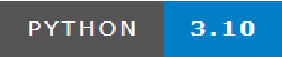

# AutoLeftPiano:让AI为您的音乐插上翅膀





Auto Left Tune 是一款面向钢琴创作与演奏的创新软件。其核心功能是：**上传仅含右手旋律的MIDI钢琴文件，利用自研AI模型自动生成左手伴奏**，极大提升钢琴编曲与学习效率。除此之外，还集成了可视化钢琴、MIDI编辑器、乐谱PDF查看、演奏教学等丰富功能。

## 主要功能

- **AI自动生成左手伴奏**  
  上传右手旋律MIDI，AI模型自动生成左手伴奏，支持自定义截取时间区间与生成长度。
- **可视化钢琴界面**  
  支持鼠标/键盘弹奏，带有"音符雨"动画，实时显示按键。
- **MIDI录制与编辑**  
  可录制弹奏生成MIDI，内置MIDI编辑器支持音符添加、删除、拖拽、属性修改、历史回溯等。
- **乐谱PDF自动生成与查看**  
  自动将MIDI转为乐谱PDF，支持在线查看与下载。
- **演奏教学与示范**  
  提供经典曲目演奏教学、键盘指法、演奏技巧及示范音频。
- **多轨道支持与可视化**  
  支持多音轨MIDI的显示与编辑，左右手音轨分色显示。

## 快速开始

### 环境要求
- Windows 10+ 或 Ubuntu 20.04+
- Python 3.10

### 代码部署
```
git clone https://github.com/VvR7/Auto-Left-Tune.git
```
Linux用户/服务器可以使用我们配置好的自动化脚本安装：
```
bash start.sh
```
若以上过程出现问题，或者是Windows用户，请手动安装依赖与下载模型：
```
cd Auto-Left-Tune  
# 建议使用 venv 或 conda 创建虚拟环境
python -m venv venv        % 如果使用 venv
source venv/bin/activate   % Linux/macOS
.\\venv\\Scripts\\activate    % Windows
conda create -n autolefttune python=3.10 -y % 如果使用 conda
conda activate autolefttune
pip install -r requirements.txt
python setup.py  %下载模型权重
```
以上操作会下载一个大约500M的模型，请保证有足够的空间
### 启动应用
```bash
python run.py
```
浏览器访问 [http://localhost:5000](http://localhost:5000)

## 页面与功能简介

- **首页**  
  可视化钢琴、MIDI录制、文件处理、AI伴奏生成、乐谱PDF查看、MIDI播放器等。
- **创作区**  
  强大的MIDI编辑器，支持音符编辑、轨道控制、历史管理、虚拟钢琴等。
- **演奏区**  
  演奏教学、经典曲目示范、键盘指法与技巧展示。
- **关于**  
  软件介绍与开发背景。

## 目录结构说明

```
AutoLeftPiano/
├── app/
│   ├── config/         # 配置文件
│   ├── files/          # 文件存储（上传/输出）
│   ├── models/         # 数据模型
│   ├── routes/         # 路由与后端逻辑
│   ├── static/         # 静态资源（CSS/JS/音频/图片）
│   ├── templates/      # 前端HTML模板
│   └── utils/          # 工具与AI模型相关代码
├── run.py              # 启动入口
├── requirements.txt    # 依赖列表
└── README.md           # 项目说明
```

## 技术栈

- **前端**：HTML5、CSS3、JavaScript (ES6)
- **后端**：Flask (Python)
- **AI模型**：自研深度学习模型（PyTorch）
- **音频播放**：Tone.js
- **乐谱生成**：MuseScore CLI

## 特色亮点

- 一键AI生成左手伴奏，极大提升编曲效率
- 可视化钢琴与MIDI编辑器，所见即所得
- 乐谱PDF自动生成，支持在线查看与下载
- 丰富的演奏教学与示范，适合学习与创作

## 联系与反馈

如有问题或建议，欢迎在项目主页提交 Issue，或联系开发者。

---

如需更详细的功能说明，请参考 Docs/用户手册.pdf。

## 技术实现

- **前端**: HTML5, CSS3, JavaScript (ES6 Modules)
- **后端**: Flask (Python)
- **音频**: Tone.js
- **动画**: CSS3 Animations with cubic-bezier easing
- **响应式**: CSS Media Queries

## 钢琴卷帘窗技术细节

卷帘窗效果通过以下技术实现：
- CSS3 渐变背景和阴影效果
- transform 和 opacity 动画
- 模糊滤镜过渡
- JavaScript 动态位置计算
- 事件驱动的动画触发

## 安装依赖

```bash
pip install -r requirements.txt
```

## 项目结构

```
AutoLeftPiano/
├── app/
│   ├── static/
│   │   ├── css/
│   │   │   └── piano.css      # 钢琴和卷帘窗样式
│   │   └── js/
│   │       └── piano.js       # 钢琴功能和动画逻辑
│   └── templates/
│       └── index.html         # 主页模板
└── run.py                     # 应用启动文件
```

## Quick Start
### Platform
Windows 10+

ubuntu 20.04+
### Start APP
pip install -r requirements.txt

python3 run.py
## 项目介绍
### 各个文件夹介绍
config: 配置文件，里面存了一些路径的信息

static: 静态资源文件夹，包含CSS、JavaScript、音频样本和音符资源

templates: HTML模板文件夹，用于前端页面渲染

files: 文件存储目录，包含uploads(上传的MIDI文件)和outputs(生成的输出文件)子目录

utils: 工具函数目录，包含transform.py用于MIDI文件处理和PDF生成

models: 数据模型目录，包含session.py用于管理用户会话数据

routes: 路由处理目录，包含main.py定义了所有HTTP请求处理逻辑
